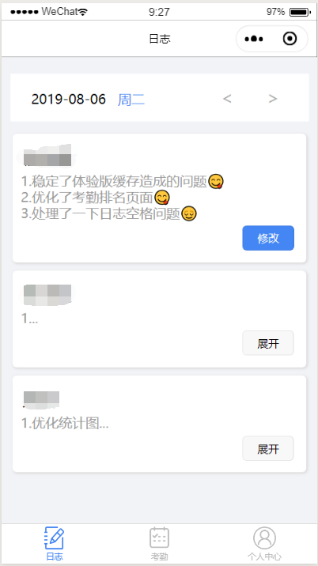
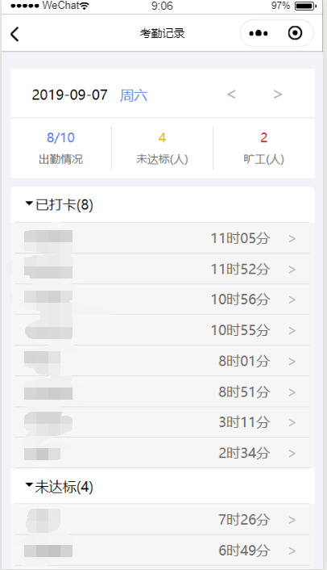
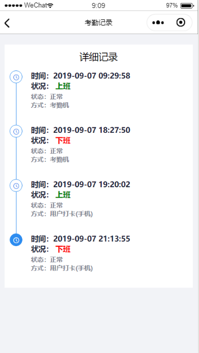
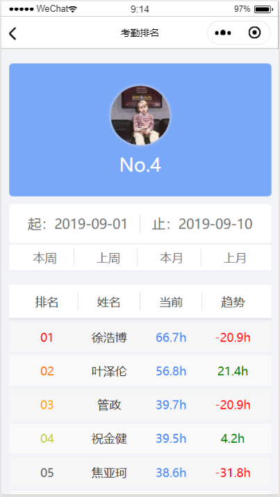
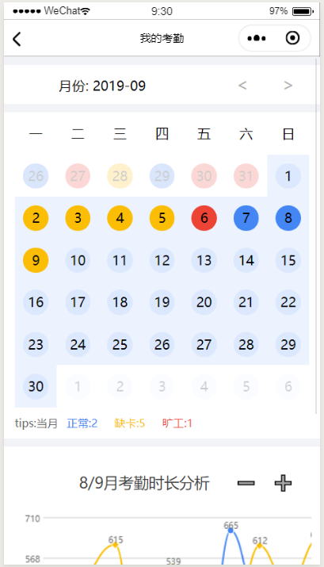
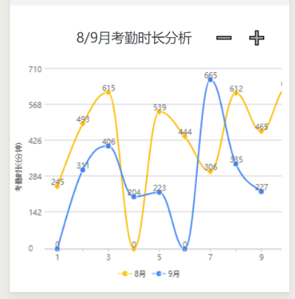

# 使用说明
```
在smallapp/app.js 55行修改服务端urlID
```
## 欢迎页

如图：若已绑定内置账号则跳转至日志页面，若第一次使用，需绑定内置账号，跳转至绑定登录页面  


## 登录

如图：  


- 首次登录小程序需要绑定内置用户信息（在数据库中添加）
  如需更改绑定需要在数据库中清除openid
- 二次登陆无需再绑定

## 日志

如图：  


显示用户每天的日志
只能修改自己的日志内容，查看他人日志
页面下拉刷新

## 考勤

### 记录

由日期控件/考勤统计/折叠选项组成  


**折叠选项**

1. 已打卡
   点开后，点击具体信息条，可查看具体考勤详情  
   

2. 未达标/旷工
   点开后，点击具体信息条，可查看个人缺勤说明

   **仅可添加和修改<u>当天的</u>个人缺勤说明，且在当天22:30之后**  
   

### 排名

由**排名**/**日期范围控件**/**具体排名信息**组成  


#### 日期范围控件

可自定义选择起/止时间，选择完毕后会自动刷新具体排名信息
可选择快捷选项本周/上周/本月/上月

#### 具体排名信息

**当前**——所选时间段的考勤统计

**趋势**——所选时间段的上一个时间段与当前所选时间段的考勤统计对比
如：选择本周，则趋势为本周和上周对比
		选择上周，则趋势为上周和上上周对比
		选择起止时间为2019.8.1-2019.8.4，则趋势为2019.8.1-2019.8.4与2019.7.27-2019.7.31

## 个人中心

如图：  


### 我的考勤

由三部分组成月份控件/日历考勤信息/考勤折线图  


**日历：**无可用操作，仅可查看当天考勤状态（正常，缺卡，旷工）

**考勤折线图**  


可横向拖动查看整月考勤情况
右上角的±符号为控制x轴宽度，可自定义设置统计图x轴稠密

### 添加日志

如图：  


可添加当天的日志内容，重复添加则为覆盖操作

